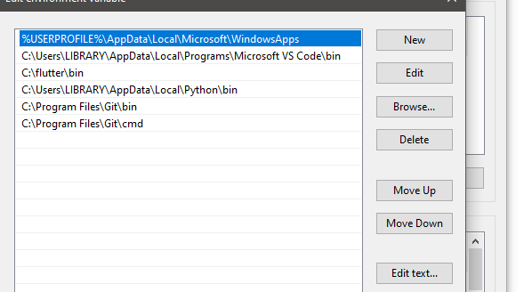
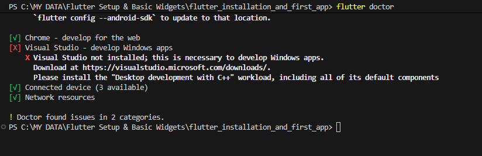
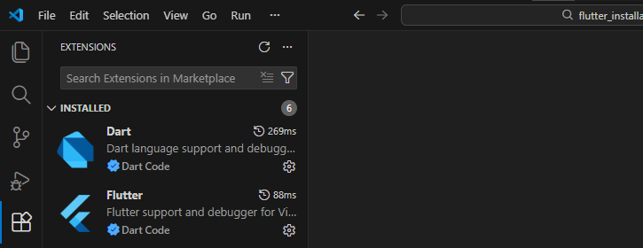
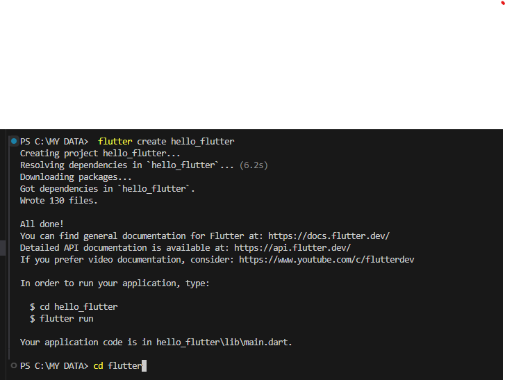
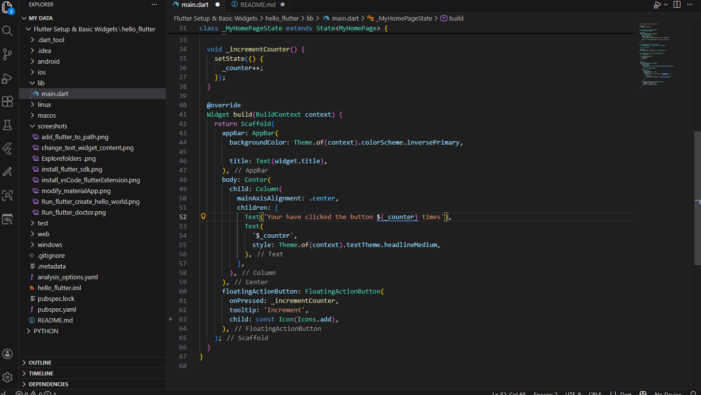
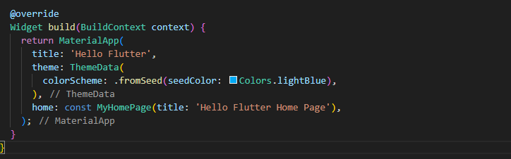
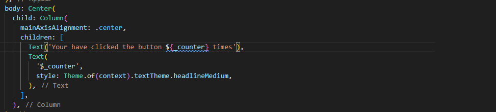
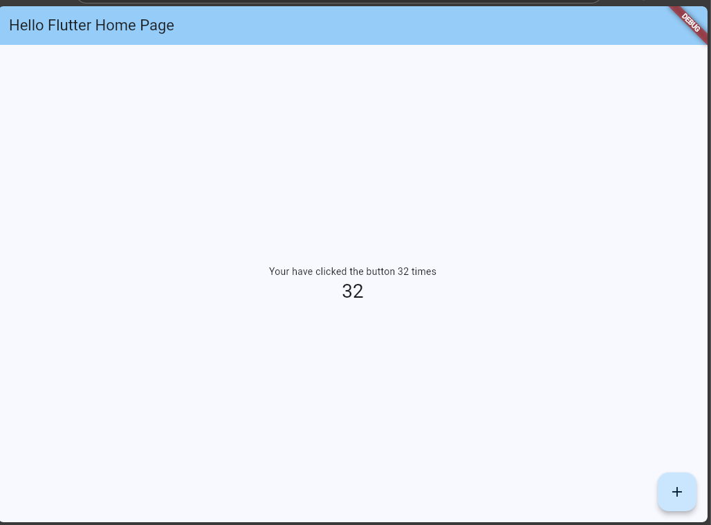

# Task 3.1: Flutter Installation & First App

## Overview
This task covers the installation of Flutter and the creation of a first Flutter application named **hello_flutter**. The objective is to set up the development environment, explore the Flutter project structure, modify UI elements, and run the application on an emulator or physical device.

---
## Steps
1. Download and install Flutter SDK

3. Add Flutter to PATH 

5. Run flutter doctor 

6. Install Android Studio

8. Install VS Code with Flutter extension 

10. Run flutter create hello_flutter 

12. Explore lib/, android/, ios/ folders 

14. Open in VS Code 

16. Modify MaterialApp title and theme 

18. Change Text widget content 

20. Run flutter run 

## Tools & Technologies
- Flutter SDK
- Visual Studio Code
- Dart
- Microsoft Edge

---

