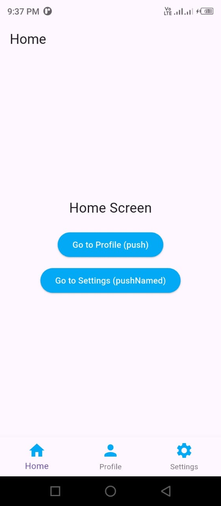

# Navigation App (Flutter)

## Task 3.4: Navigation & Routes

This Flutter project demonstrates **navigation and routing concepts** using multiple screens. The application contains **three screens**: Home, Profile, and Settings. It covers both **direct navigation** and **named routes**, data passing between screens, and a **Bottom Navigation Bar**.

---

## Features Implemented

- Multiple screens using Flutter
- Navigation using:
  - `Navigator.push()`
  - `Navigator.pop()`
  - `Navigator.pushNamed()`
- Named routes defined in `MaterialApp`
- Passing data using:
  - Constructor parameters
  - `ModalRoute.of(context).settings.arguments`
- Bottom Navigation Bar
- Screen switching using `setState()`

---

## Screens

### 1. Home Screen
- Entry screen of the application
- Contains buttons to navigate to:
  - Profile Screen using `Navigator.push()`
  - Settings Screen using `Navigator.pushNamed()`
- Includes Bottom Navigation Bar

### 2. Profile Screen
- Receives data via constructor parameters
- Displays username passed from Home Screen
- Uses `Navigator.pop()` to return to the previous screen

### 3. Settings Screen
- Receives data using route arguments
- Displays the received argument
- Uses `Navigator.pop()` to return

---

## Project ScreenShots

.jpeg)

