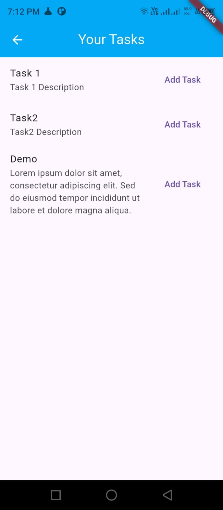
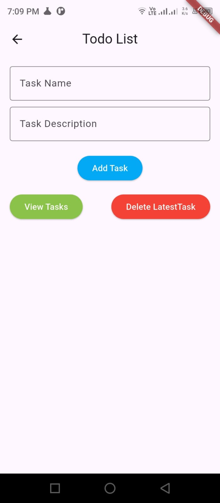
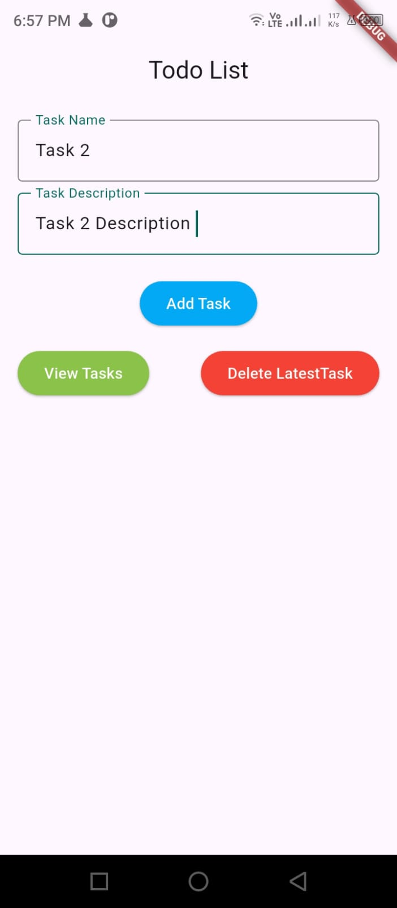

# Todo App – Stateful Widgets & State Management

## Task 3.3: Todo Application (Flutter)

This project demonstrates **state management in Flutter** by developing a simple **Todo application**.  
The app allows users to **add tasks**, **display them in a list**, and **remove the latest task**.

The purpose of this task is to understand how Flutter updates the UI when data changes using `StatefulWidget` and `setState()`.

---

## Objective

- Learn how to use `StatefulWidget`
- Manage dynamic data using lists
- Capture user input using `TextEditingController`
- Update the UI in real time using `setState()`
- Display lists using `ListView.builder()`

---

## Application Features

- Add new todo tasks
- Display all tasks in a scrollable list
- Delete the task, this functionality follow the stack rules, delete the latest entered task
- Instant UI updates when tasks are added or removed

---

## Core Concepts Used

### StatefulWidget
- The `TodoPage` is implemented as a `StatefulWidget` to manage dynamic data.

### State Management
- A `List<String>` is used to store todo items.
- `setState()` is used whenever the list is updated so the UI refreshes automatically.

### User Input
- `TextEditingController` captures text entered by the user.
- Input field is cleared after adding a task.

### Dynamic List Rendering
- `ListView.builder()` is used to efficiently display todo items.
- Each list item is created dynamically based on the list length.

### Delete Functionality
- Tapping on a  delete button the latest item removed from the list.
- The UI updates immediately after deletion.

---

## How It Works

1. User enters a task in the text field
2. Presses the **Add** button
3. Task is added to the list using `setState()`
4. `ListView.builder()` rebuilds and shows the updated list
5. User taps a task to remove it

## images

---
